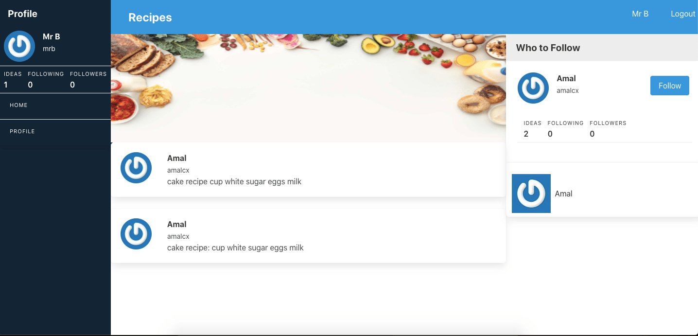
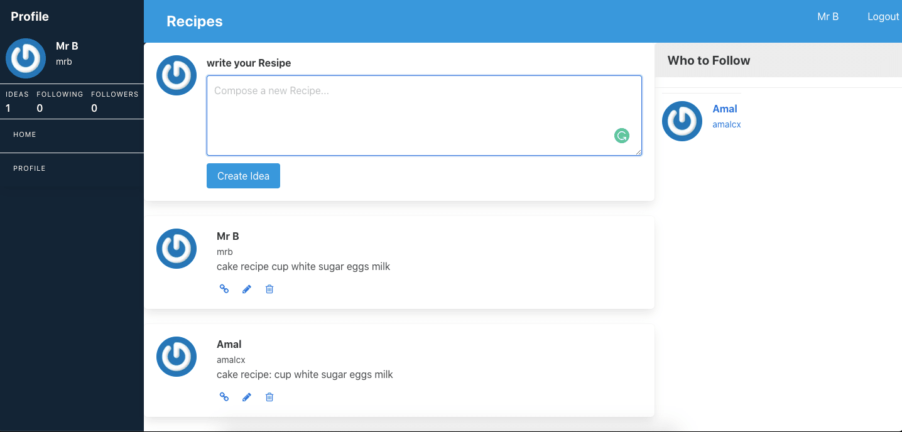

# cooking App 

> this is a website that people who love to cook can exchanges cooking ides and resipes and follow each other for more information about cooking.

## Built With

- Ruby v2.7.0
- Ruby on Rails v5.2.4

## Live Demo
[Live Demo](https://evening-ridge-66508.herokuapp.com/users/sign_in)

### Prerequisites

Ruby: 2.6.3
Rails: 5.2.3
Postgres: >=9.5

### Setup
  - Use your github account and your terminal to clone this repository to your computer:

  - git clone https://github.com/Amalcxc/cooking-app.git

  - Go to the cloned directory: cd ror-social-scaffold

  - Run bundler install to install the Gems for the project

  - Run yarn install to install the project dependencies

  - Run rails db:migrate to create and setup the database

### Usage

Start server with: Run rails s and go to http://localhost:3000/ in your browser.

### Deployment

- Heroku

## Authors

👤 **Amal Hersi**

- GitHub: [Amal Hersi](https://github.com/Amalcxc)

- Twitter: [@Amalcx4](https://twitter.com/home?lang=en)

- LinkedIn: [Amal Hersi](https://www.linkedin.com/in/amal-hersi-a29583205/)

## 🤝 Contributing

Contributions, issues and feature requests are welcome!

Feel free to check the [issues page](issues/).

## Show your support

Give a ⭐️ if you like this project!

## Acknowledgments

TBA

## 📝 License

TBA

